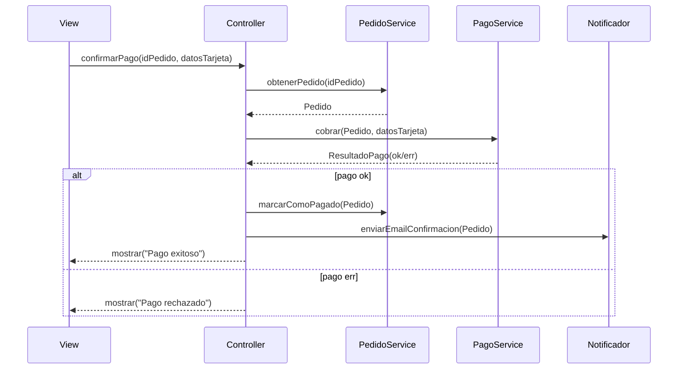
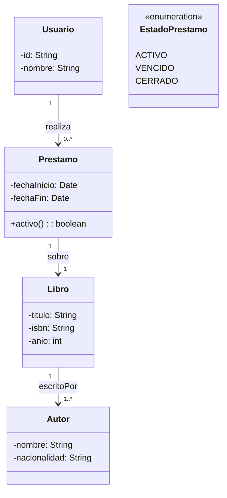

# Resumen de Programación Orientada a Objetos en Java (Semestre 2)

Autor: IngJhonP  
Repositorio base: [Archivos](https://github.com/IngJhonP/Archivos)  
Rama de trabajo sugerida: `docs-resumen`

Este documento es un material de estudio integral de POO en Java. Reúne y amplía los contenidos vistos en clase, añade explicaciones detalladas, analogías, ejemplos, ejercicios guiados y diagramas. No depende de un único proyecto; los ejemplos son generales y prácticos.

---

## Tabla de contenido
- [0. Material base (presentaciones y documentos)](#0-material-base-presentaciones-y-documentos)
- [1. Fundamentos de programación](#1-fundamentos-de-programación)
- [2. Java base: estructura, entrada/salida, String y wrappers](#2-java-base-estructura-entradasalida-string-y-wrappers)
- [3. Arreglos y matrices (1D/2D)](#3-arreglos-y-matrices-1d2d)
- [4. Excepciones y manejo de errores](#4-excepciones-y-manejo-de-errores)
- [5. POO I: clases, objetos, encapsulación, constructores, static, inmutabilidad](#5-poo-i-clases-objetos-encapsulación-constructores-static-inmutabilidad)
- [6. POO II: herencia, interfaces, clases abstractas, polimorfismo, composición](#6-poo-ii-herencia-interfaces-clases-abstractas-polimorfismo-composición)
- [7. Interacción de objetos, responsabilidades y MVC](#7-interacción-de-objetos-responsabilidades-y-mvc)
- [8. Relaciones entre objetos (UML): asociación, agregación, composición, dependencias](#8-relaciones-entre-objetos-uml-asociación-agregación-composición-dependencias)
- [9. Colecciones y genéricos](#9-colecciones-y-genéricos)
- [10. Principios y calidad: SOLID, DRY/KISS/YAGNI, pruebas](#10-principios-y-calidad-solid-drykissyagni-pruebas)
- [11. Ejercicios integradores](#11-ejercicios-integradores)
- [12. Recursos en video y artículos](#12-recursos-en-video-y-artículos)
- [13. Glosario rápido](#13-glosario-rápido)
- [Anexo A. Consejos de Mermaid en GitHub](#anexo-a-consejos-de-mermaid-en-github)

---

## 0. Material base (presentaciones y documentos)
- Presentación 0 — Programación Básica: 
  [PDF](https://github.com/IngJhonP/Archivos/blob/main/Presentaci%C3%B3n%200%20-%20Programaci%C3%B3n%20B%C3%A1sica.pdf) · 
  [DOCX](https://github.com/IngJhonP/Archivos/blob/main/Presentaci%C3%B3n%200%20-%20Programaci%C3%B3n%20B%C3%A1sica.docx)
- Presentación 1 — Java 1:
  [PDF](https://github.com/IngJhonP/Archivos/blob/main/Presentaci%C3%B3n%201%20-%20Java%201.pdf) · 
  [DOCX](https://github.com/IngJhonP/Archivos/blob/main/Presentaci%C3%B3n%201%20-%20Java%201.docx)
- Presentación 1 — Java 2:
  [PDF](https://github.com/IngJhonP/Archivos/blob/main/Presentaci%C3%B3n%201%20-%20Java%202.pdf) · 
  [DOCX](https://github.com/IngJhonP/Archivos/blob/main/Presentaci%C3%B3n%201%20-%20Java%202.docx)
- Presentación 2 — Objetos I:
  [PDF](https://github.com/IngJhonP/Archivos/blob/main/Presentaci%C3%B3n%202%20-%20Objetos%20I.pdf)
- Presentación 2 — Objetos II:
  [PDF](https://github.com/IngJhonP/Archivos/blob/main/Presentaci%C3%B3n%202%20-%20Objetos%20II.pdf) · 
  [DOCX](https://github.com/IngJhonP/Archivos/blob/main/Presentaci%C3%B3n%202%20-%20Objetos%20II.docx)
- Presentación 3 — Interacción de Objetos:
  [PDF](https://github.com/IngJhonP/Archivos/blob/main/Presentaci%C3%B3n%203%20-%20Interacci%C3%B3n%20de%20Objetos.pdf) · 
  [DOCX](https://github.com/IngJhonP/Archivos/blob/main/Presentaci%C3%B3n%203%20-%20Interacci%C3%B3n%20de%20Objetos.docx)
- Presentación 4 — Relación entre Objetos I:
  [PDF](https://github.com/IngJhonP/Archivos/blob/main/Presentaci%C3%B3n%204%20-%20Relaci%C3%B3n%20entre%20Objetos%20I.pdf) · 
  [DOCX](https://github.com/IngJhonP/Archivos/blob/main/Presentaci%C3%B3n%204%20-%20Relaci%C3%B3n%20entre%20Objetos%20I.docx)
- Presentación 4 — Relación entre Objetos II:
  [PDF](https://github.com/IngJhonP/Archivos/blob/main/Presentaci%C3%B3n%204%20-%20Relaci%C3%B3n%20entre%20Objetos%20II.pdf.pdf) · 
  [DOCX](https://github.com/IngJhonP/Archivos/blob/main/Presentaci%C3%B3n%204%20-%20Relaci%C3%B3n%20entre%20Objetos%20II.pdf.docx)
- Documento adicional — Semestre 2 - Programación orientada a objetos:
  [PDF](https://github.com/IngJhonP/Archivos/blob/main/Semestre%202%20-%20Programaci%C3%B3n%20orientada%20a%20objetos.pdf)

---

## 1. Fundamentos de programación
Objetivo: expresar algoritmos correctos y legibles.

- Conceptos base
  - Tipos primitivos: byte, short, int, long, float, double, char, boolean.
  - Referencias: String, arrays, objetos.
  - Operadores: aritméticos, lógicos (&&, ||, !), relacionales (<, >, ==, !=), asignación (+=, -=).
  - Control de flujo: if/else, switch, for, while, do/while, break/continue.
  - Métodos: firma, parámetros, retorno; alcance (scope) de variables.
- Analogía
  - Programa = receta: ingredientes (variables), pasos (instrucciones), decisiones (si está horneado), repeticiones (amasar 10 veces).
- Ejemplos
```java
// Suma de pares
int sumaPares(int[] a) {
  int s = 0;
  for (int x : a) if (x % 2 == 0) s += x;
  return s;
}

// Tabla multiplicar
void tabla(int n) {
  for (int i = 1; i <= 10; i++) {
    System.out.printf("%d x %d = %d%n", n, i, n * i);
  }
}
```
- Errores frecuentes
  - Off-by-one en bucles; usar == con Strings (usar equals).
  - ArrayIndexOutOfBounds: validar índices.
- Ejercicios
  - Contar ocurrencias de un valor.
  - Rotar array k posiciones.
  - Matriz identidad NxN.

---

## 2. Java base: estructura, entrada/salida, String y wrappers
- Estructura mínima y paquetes
```java
package edu.curso;

public class App {
  public static void main(String[] args) {
    System.out.println("Hola");
  }
}
```
- Entrada con Scanner y salida formateada
```java
import java.util.Scanner;
Scanner sc = new Scanner(System.in);
System.out.print("Edad: ");
int edad = sc.nextInt(); sc.nextLine(); // limpiar
System.out.print("Nombre: ");
String nombre = sc.nextLine();
System.out.printf("Hola %s, %d años%n", nombre, edad);
```
- String y wrappers
  - String: inmutable; métodos length, substring, indexOf, equals, toUpperCase.
  - Wrappers: Integer, Double; parsing: Integer.parseInt("42").
- Buenas prácticas
  - Paquetes en minúsculas; clases en PascalCase; métodos y variables en camelCase.
  - Evitar concatenación masiva de String en bucles (usar StringBuilder).
- Ejercicios
  - Normalizar nombres (trim, capitalizar).
  - Formatear números con dos decimales.

---

## 3. Arreglos y matrices (1D/2D)
- Conceptos
  - Arrays de longitud fija; matrices como arrays de arrays.
  - Recorridos, límites, valores por defecto.
- Ejemplos
```java
// Suma de matriz
int suma(int[][] m) {
  int s = 0;
  for (int i = 0; i < m.length; i++)
    for (int j = 0; j < m[i].length; j++)
      s += m[i][j];
  return s;
}

// Traspuesta
int[][] traspuesta(int[][] m) {
  int n = m.length, k = m[0].length;
  int[][] t = new int[k][n];
  for (int i = 0; i < n; i++)
    for (int j = 0; j < k; j++)
      t[j][i] = m[i][j];
  return t;
}
```
- Errores frecuentes
  - Suposiciones sobre que todas las filas tienen igual longitud.
- Ejercicios
  - Rotación 90° de matriz cuadrada.
  - Detección de línea, columna o diagonal con todos iguales (3×3 o NxN).

---

## 4. Excepciones y manejo de errores
- Conceptos
  - Jerarquía: Throwable → Exception (checked) / RuntimeException (unchecked).
  - try/catch/finally, throw/throws, mensajes claros.
- Ejemplos
```java
int dividir(int a, int b) {
  if (b == 0) throw new IllegalArgumentException("b no puede ser 0");
  return a / b;
}

try {
  int r = dividir(10, 0);
} catch (IllegalArgumentException e) {
  System.err.println("Error: " + e.getMessage());
} finally {
  System.out.println("Siempre se ejecuta");
}
```
- Buenas prácticas
  - No capturar Exception genérica salvo justificación.
  - No silenciar errores; registrar o propagar.
- Ejercicios
  - Implementar una excepción checked propia y manejarla en un flujo de lectura.

---

## 5. POO I: clases, objetos, encapsulación, constructores, static, inmutabilidad
- Encapsulación y estado válido
```java
public final class Cuenta {
  private double saldo;
  public Cuenta(double inicial) {
    if (inicial < 0) throw new IllegalArgumentException("Saldo negativo");
    this.saldo = inicial;
  }
  public double getSaldo() { return saldo; }
  public void depositar(double m) {
    if (m <= 0) throw new IllegalArgumentException("Monto inválido");
    saldo += m;
  }
  public boolean retirar(double m) {
    if (m <= 0 || m > saldo) return false;
    saldo -= m; return true;
  }
}
```
- Constructores y `this`; miembros `static` (constantes/utilidades).
- Inmutabilidad
  - Clases con campos `final` y sin setters.
- Analogía
  - Clase = plano; Objeto = casa construida; Encapsulación = candados/puertas.
- Ejercicios
  - Clase `Vector2D` inmutable con `add`, `scale`, `magnitude`.
  - Clase `Producto` con validaciones y `toString`.

---

## 6. POO II: herencia, interfaces, clases abstractas, polimorfismo, composición
- Herencia y abstracción
```java
abstract class Empleado {
  private final String nombre;
  Empleado(String n) { this.nombre = n; }
  public String getNombre() { return nombre; }
  public abstract double salarioMensual();
}
final class EmpleadoFijo extends Empleado {
  private final double base;
  EmpleadoFijo(String n, double base){super(n); this.base=base;}
  public double salarioMensual(){ return base; }
}
final class EmpleadoPorHoras extends Empleado {
  private final int horas; private final double tarifa;
  EmpleadoPorHoras(String n,int h,double t){super(n); horas=h; tarifa=t;}
  public double salarioMensual(){ return horas*tarifa; }
}
```
- Interfaces y polimorfismo
```java
interface Exportable { String exportarCSV(); }
final class Producto implements Exportable {
  public String exportarCSV(){ return "id,nombre,precio"; }
}
```
- Composición vs. herencia
  - “Tiene un” (composición) vs. “Es un” (herencia). Preferir composición para reutilización flexible.
- Principio de sustitución de Liskov; segregación de interfaces.
- Ejercicios
  - Diseñar `Repositorio<T>` (interface) con implementaciones en memoria y archivo.
  - Jerarquía `Figura` con `area()` y `perimetro()`; añadir `Renderer`.

---

## 7. Interacción de objetos, responsabilidades y MVC
- Responsabilidades (SRP)
  - Cada clase con una razón de cambio.
- MVC
  - Model: reglas/estado; Controller: coordina casos de uso; View: I/O (consola/GUI).
- Diagrama de secuencia — “Confirmar pago”

- Errores comunes
  - Lógica de negocio en la vista; controladores “Dios”.
- Ejercicios
  - Dibujar secuencia “Registro de cliente” y “Cancelación de pedido”.

---

## 8. Relaciones entre objetos (UML): asociación, agregación, composición, dependencias
- Conceptos
  - Asociación (conoce a), agregación (tiene un, vida independiente), composición (parte-de, vida dependiente), dependencia (usa).
  - Multiplicidades: 1..1, 1..*, 0..*, 0..1; navegabilidad.
- Diagrama de clases — “Biblioteca”

- Notas Mermaid
  - En GitHub evita `enum` y usa `<<enumeration>>`.
- Ejercicios
  - Modelar “Curso-Estudiante-Profesor” (muchos a muchos con entidad intermedia “Inscripción”).
  - Modelar “Pedido-Detalle-Producto-Cliente”.

---

## 9. Colecciones y genéricos
- Vistazo general
  - List, Set, Map; implementaciones comunes: ArrayList, LinkedList, HashSet, HashMap, TreeMap.
- Uso básico
```java
List<String> nombres = new ArrayList<>();
nombres.add("Ana"); nombres.add("Luis");
for (String n : nombres) System.out.println(n);

Map<String,Integer> stock = new HashMap<>();
stock.put("lapiz", 10);
stock.put("cuaderno", 5);
System.out.println(stock.getOrDefault("goma", 0));
```
- Genéricos
```java
class Caja<T> {
  private T valor;
  public Caja(T v){ this.valor = v; }
  public T get(){ return valor; }
}
Caja<Integer> c = new Caja<>(5);
```
- Buenas prácticas
  - Elegir estructura adecuada: búsqueda por clave → Map; evitar duplicados → Set; orden natural → TreeSet/TreeMap.
- Ejercicios
  - Contar frecuencias de palabras con Map.
  - Ordenar objetos por múltiples criterios usando Comparator.

---

## 10. Principios y calidad: SOLID, DRY/KISS/YAGNI, pruebas
- Principios
  - SOLID (SRP, OCP, LSP, ISP, DIP), DRY, KISS, YAGNI.
- Pruebas (nociones)
```java
// Esqueleto conceptual (sin dependencias)
void testCuenta() {
  Cuenta c = new Cuenta(100);
  assert c.retirar(30);
  assert c.getSaldo() == 70;
  assert !c.retirar(1000);
}
```
- Analogía
  - Las pruebas son cinturones de seguridad: te permiten refactorizar con confianza.
- Ejercicios
  - Diseñar casos de prueba para `Producto` y `Repositorio<T>`.

---

## 11. Ejercicios integradores
- Consola
  - Agenda de Contactos (CRUD en memoria con búsqueda).
  - Gestor de Tareas con prioridades, filtros y persistencia simple (archivo).
- POO y UML
  - Sistema de Reservas de Hotel (Habitación compuesta por Camas; Reservas con fechas).
  - E-commerce simplificado: Carrito, Línea de Carrito, Pago, Notificaciones.
- Colecciones
  - Analizador de texto: top 10 palabras más frecuentes (Map + Comparator).
- MVC
  - App de Notas: Model (Nota), View (consola), Controller (crear/listar/buscar).

---

## 12. Recursos en video y artículos
- Fundamentos y POO (ES)
  - [freeCodeCamp — Java para principiantes](https://www.youtube.com/watch?v=4p7Ax0l3n2k)
  - [MoureDev — POO en Java](https://www.youtube.com/watch?v=diI1sFBI-ig)
  - [midudev — POO conceptos clave](https://www.youtube.com/watch?v=tj5sLSFjVj4)
- UML y diseño
  - [Lucidchart — Diagrama de clases UML](https://www.lucidchart.com/pages/es/diagrama-de-clases-uml)
  - [Refactoring.Guru — SOLID](https://refactoring.guru/es/design-patterns/solid)
- Patrones y arquitectura
  - [GeeksforGeeks — MVC Design Pattern](https://www.geeksforgeeks.org/mvc-design-pattern/)

---

## 13. Glosario rápido
- Encapsulación: ocultar detalles internos y exponer una API segura.
- Cohesión: foco en una responsabilidad (mejor alta).
- Acoplamiento: dependencia entre módulos (mejor bajo).
- Polimorfismo: múltiples implementaciones bajo un mismo contrato.
- Invariante: condición que siempre debe cumplirse para mantener estado válido.
- Composición: un objeto contiene a otros y controla su ciclo de vida.

---

## Anexo A. Consejos de Mermaid en GitHub
- Usa bloques con ```mermaid sin espacios extra.
- Evita la palabra clave `enum`; prefiere clases con `<<enumeration>>`.
- Evita caracteres invisibles o líneas partidas dentro del bloque.
